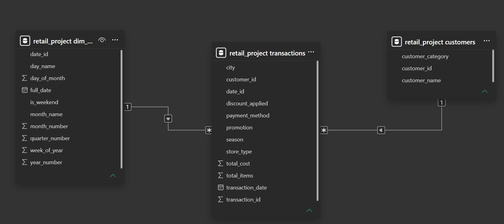

# Retail Sales Analysis using MySQL

## Project Overview

This project demonstrates an end-to-end SQL data analytics workflow using a retail transaction dataset containing one million records. The project focuses on importing, cleaning, normalizing, and analyzing transactional data to answer real-world business questions.

Rather than querying a single flat table, the dataset was transformed into a relational database using normalization techniques, enabling more efficient storage and analysis.

---

## Objectives

* Import and clean a large retail dataset.
* Normalize the database into relational tables.
* Improve query performance through indexing and primary keys.
* Perform business-driven SQL analysis.
* Document data quality issues and project limitations.
* Generate a relational model for reporting tools such as Power BI.

---

## Database Design

The project follows a normalized relational design consisting of:

* Customers
* Transactions
* Date Dimension

Relationships were validated using Power BI's Model View.

---

## SQL Skills Demonstrated

* Database creation
* Data import using `LOAD DATA INFILE`
* Data cleaning and deduplication
* Table normalization
* Primary and foreign keys
* Index creation
* Aggregate functions
* JOIN operations
* GROUP BY analysis
* Data validation
* Business-oriented SQL queries

---

## Business Questions Answered

### Revenue Analysis

* Which city generates the highest revenue?
* Which store type performs best?
* What are the monthly revenue trends?
* Which season drives the most sales?

### Customer Analysis

* Who are the highest-spending customers?
* Which customer segment generates the most revenue?
* Do professionals spend more than students?
* Which customer category shops most frequently?

### Promotion Analysis

* Do promotions increase revenue?
* Which promotion performs best?
* Do discounts improve average transaction value?

### Payment Analysis

* Which payment method is most popular?
* Which payment method generates the highest revenue?
* Do mobile payment users spend more?

---

## Key Findings

* Revenue is evenly distributed across cities and store types.
* Customer spending is remarkably consistent across demographic segments.
* Promotions did not significantly increase average transaction values.
* Payment methods showed nearly identical spending behaviour.
* Customer names were not unique and required a composite business key during normalization.

---

## Dataset Limitations

The dataset records revenue at the transaction level rather than the product level.

Because individual product quantities and prices were unavailable, product-level revenue analysis and market basket analysis could not be performed reliably.

Additionally, inconsistencies between the `Total_Items` field and the products listed prevented a reliable analysis of basket size.

---

## Technologies Used

* MySQL Server
* MySQL Workbench
* Power BI (Model View only)

---

## Future Improvements

* Parse product arrays into Product and Transaction_Items tables.
* Create SQL views for reporting.
* Build an interactive Power BI dashboard.
* Perform market basket analysis.
* Implement stored procedures and triggers.
